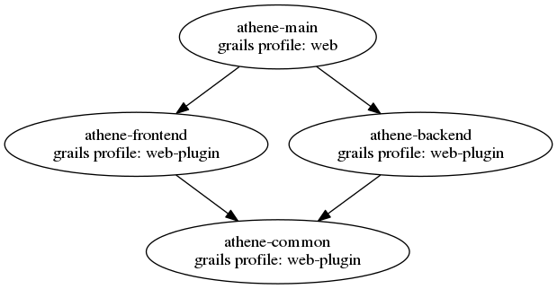

# Grails Modularization

This project shows a way how to modularize a Grails application. 

The illustration shows how the application is structured.

For more information visit my blog at [kubera.github.io](http://kubera.github.io/modularize-a-grails-application).

